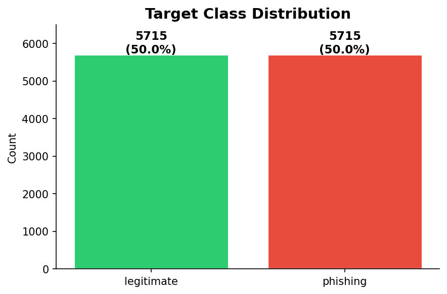
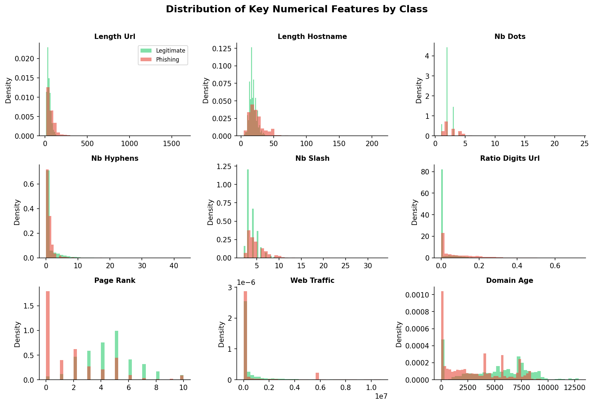
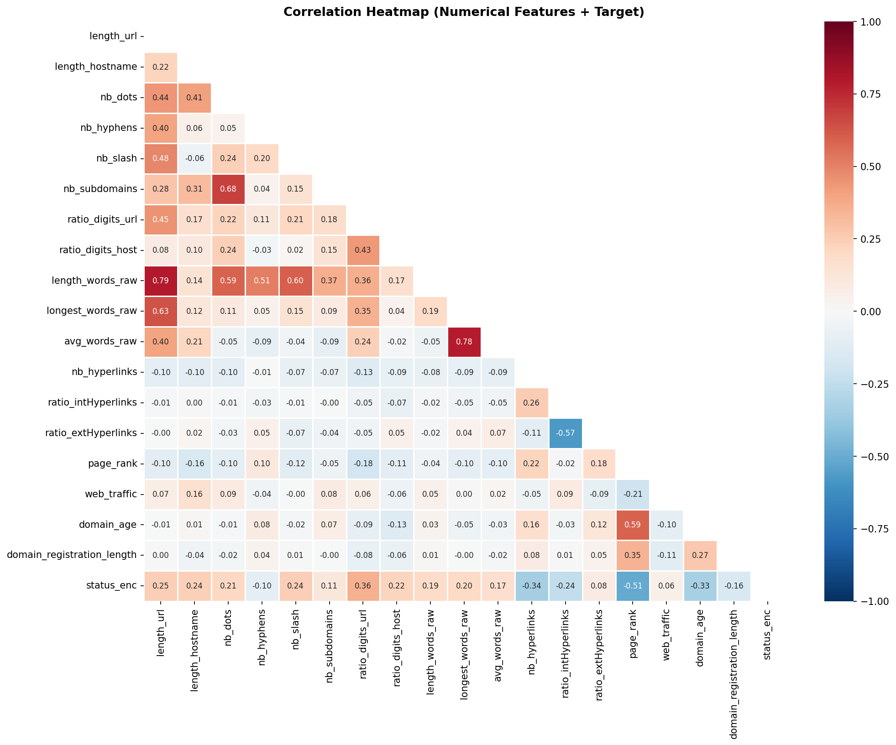
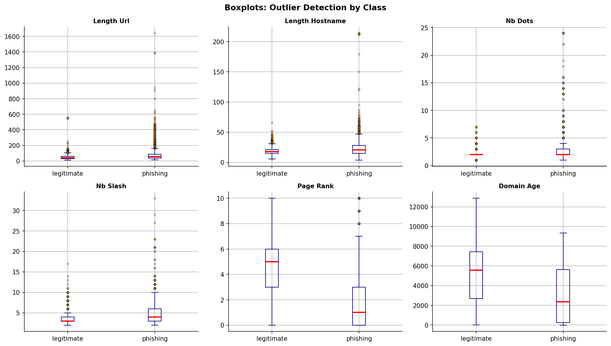
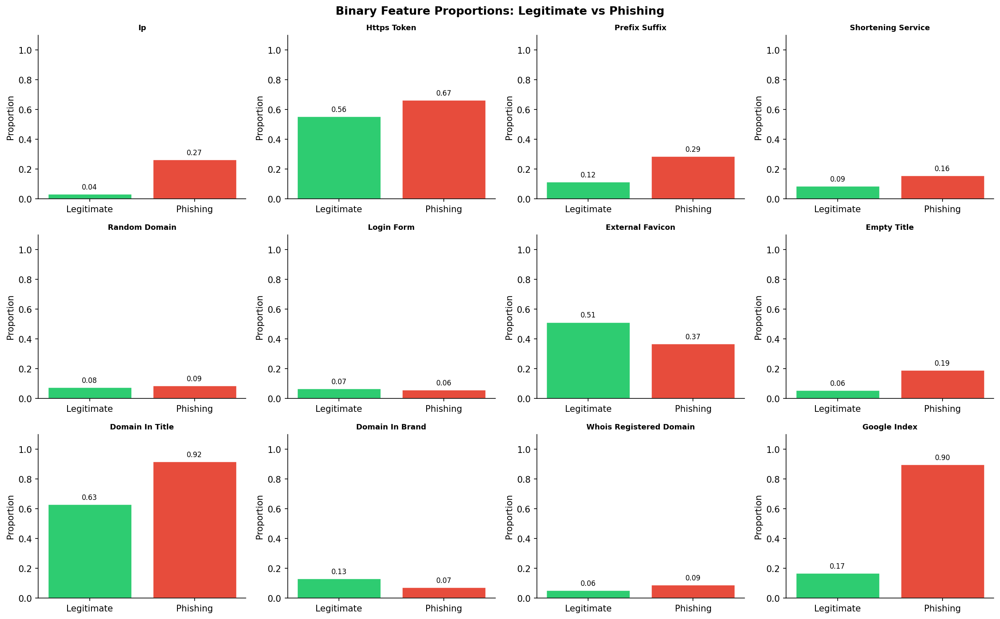
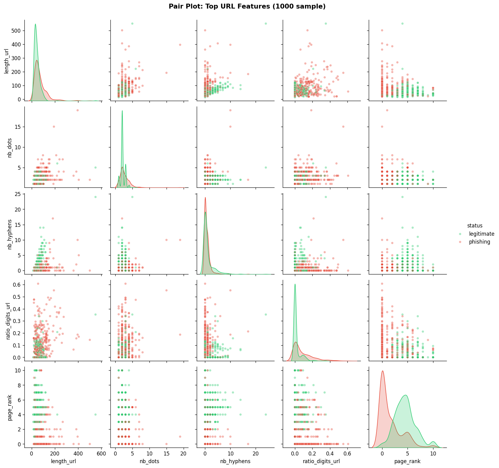

# Exploratory Data Analysis Report
## Phishing URL Detection Dataset — Week 2 Assignment

---

## INTERN DETAILS
| | |
|:---:|:---:|
| Intern Name | Rushik Rajendra Kokate |
| Intern ID | #37018 |
| Program | Code B - Data Science Integrated Internship |
| Organization | ITVedant |
| Date | March 2026 |
| Week | 2 of 8 |
| GitHub | [Link](https://github.com/Kokate-Rushik/ITVedant_Data_Science_Integrated_Internship/tree/main/Week2) |

---

## 1. Dataset Overview

| Property | Value |
|---|---|
| Total Records | 11,430 |
| Total Features | 89 (88 predictors + 1 target) |
| Target Column | `status` (legitimate / phishing) |
| Missing Values | **0** (no missing data) |
| Duplicate Rows | Not detected |
| Feature Types | 2 string columns (`url`, `status`), 87 integer/float columns |

The dataset is a rich collection of URL-based, HTML content-based, and external service-based features extracted from web pages, intended for phishing detection.

---

## 2. Target Variable — Class Balance

| Class | Count | Proportion |
|---|---|---|
| `legitimate` | 5,715 | 50.0% |
| `phishing` | 5,715 | 50.0% |

**Insight:** The dataset is **perfectly balanced** (50/50 split). This is ideal for classification — no resampling techniques (SMOTE, oversampling) are needed. Model performance can be evaluated directly with accuracy, F1-score, and AUC-ROC without class-weight adjustments.

---

## 3. Feature Categories

Features were grouped into four logical categories:

### 3.1 URL-Structure Features (lexical)
These capture statistical properties of the raw URL string: `length_url`, `length_hostname`, `nb_dots`, `nb_hyphens`, `nb_slash`, `nb_at`, `nb_qm`, `nb_and`, `nb_eq`, `nb_underscore`, `nb_percent`, `nb_colon`, `nb_www`, `nb_com`, `ratio_digits_url`, `ratio_digits_host`, `https_token`, `shortening_service`, `punycode`, `port`, `prefix_suffix`, `random_domain`, `ip`, `abnormal_subdomain`, `nb_subdomains`, `tld_in_path`, `tld_in_subdomain`, `statistical_report`, `suspecious_tld`, `phish_hints`.

### 3.2 Word / Token Features
Derived from splitting the URL and page content into tokens: `length_words_raw`, `char_repeat`, `shortest_words_raw`, `shortest_word_host`, `shortest_word_path`, `longest_words_raw`, `longest_word_host`, `longest_word_path`, `avg_words_raw`, `avg_word_host`, `avg_word_path`.

### 3.3 HTML Content Features
Extracted from the page DOM: `nb_hyperlinks`, `ratio_intHyperlinks`, `ratio_extHyperlinks`, `ratio_nullHyperlinks`, `nb_extCSS`, `ratio_intRedirection`, `ratio_extRedirection`, `ratio_intErrors`, `ratio_extErrors`, `login_form`, `external_favicon`, `links_in_tags`, `submit_email`, `ratio_intMedia`, `ratio_extMedia`, `sfh`, `iframe`, `popup_window`, `safe_anchor`, `onmouseover`, `right_clic`, `empty_title`, `domain_in_title`, `domain_with_copyright`.

### 3.4 External Service / WHOIS Features
From third-party reputation sources: `whois_registered_domain`, `domain_registration_length`, `domain_age`, `web_traffic`, `dns_record`, `google_index`, `page_rank`, `domain_in_brand`, `brand_in_subdomain`, `brand_in_path`.

---

## 4. Descriptive Statistics — Numerical Features

| Feature | Mean | Std | Min | 25% | Median | 75% | Max | Skewness |
|---|---|---|---|---|---|---|---|---|
| `length_url` | 61.1 | 55.3 | 12 | 33 | 47 | 71 | 1641 | 8.09 |
| `length_hostname` | 21.1 | 10.8 | 4 | 15 | 19 | 24 | 214 | 5.16 |
| `nb_dots` | 2.48 | 1.37 | 1 | 2 | 2 | 3 | 24 | 5.72 |
| `nb_hyphens` | 1.00 | 2.09 | 0 | 0 | 0 | 1 | 43 | 4.70 |
| `nb_slash` | 4.29 | 1.88 | 2 | 3 | 4 | 5 | 33 | 2.73 |
| `nb_subdomains` | 2.23 | 0.64 | 1 | 2 | 2 | 3 | 3 | −0.24 |
| `ratio_digits_url` | 0.053 | 0.089 | 0 | 0 | 0 | 0.079 | 0.724 | 2.19 |
| `ratio_digits_host` | 0.025 | 0.093 | 0 | 0 | 0 | 0 | 0.800 | 5.59 |
| `nb_hyperlinks` | 87.2 | 166.8 | 0 | 9 | 34 | 101 | 4659 | 7.68 |
| `ratio_intHyperlinks` | 0.602 | 0.376 | 0 | 0.225 | 0.743 | 0.945 | 1.0 | −0.53 |
| `ratio_extHyperlinks` | 0.277 | 0.320 | 0 | 0 | 0.131 | 0.475 | 1.0 | 1.01 |
| `page_rank` | 3.19 | 2.54 | 0 | 1 | 3 | 5 | 10 | 0.45 |
| `web_traffic` | 856,757 | 1,995,606 | 0 | 0 | 1,651 | 373,846 | 10,767,990 | 2.78 |
| `domain_age` | 4,063 | 3,108 | −12 | 972 | 3,993 | 7,027 | 12,874 | 0.16 |
| `domain_registration_length` | 492.5 | 814.8 | −1 | 84 | 242 | 449 | 29,829 | 9.82 |
| `longest_words_raw` | 15.4 | 22.1 | 2 | 9 | 11 | 16 | 829 | 13.53 |

**Key observations:**
- Most URL-lexical features are **heavily right-skewed** (skewness > 2), indicating a long tail of unusually long or complex URLs predominantly associated with phishing.
- `page_rank` and `domain_age` are the most normally distributed among all numerical features.
- Negative minimum values in `domain_age` (−12 days) and `domain_registration_length` (−1) are data anomalies and should be treated as noise or sentinel values during modelling.

---

## 5. Missing Values

**No missing values were found across all 89 columns.** The dataset is complete and requires no imputation.

---

## 6. Zero-Variance (Constant) Features

The following **6 features carry no information** as they take a single constant value across all 11,430 rows:

| Feature | Constant Value | Implication |
|---|---|---|
| `nb_or` | 0 | Always zero — drop before modelling |
| `ratio_nullHyperlinks` | 0 | Always zero — drop before modelling |
| `ratio_intRedirection` | 0 | Always zero — drop before modelling |
| `ratio_intErrors` | 0 | Always zero — drop before modelling |
| `submit_email` | 0 | Always zero — drop before modelling |
| `sfh` | 0 | Always zero — drop before modelling |

These features should be **removed** in preprocessing as they contribute zero discriminative power.

---

## 7. Outlier Analysis (IQR Method)

Outliers were identified using the 1.5×IQR rule:

| Feature | Outlier Count | % of Dataset |
|---|---|---|
| `length_hostname` | 775 | 6.8% |
| `length_url` | 620 | 5.4% |
| `nb_dots` | 567 | 5.0% |
| `nb_slash` | 401 | 3.5% |
| `page_rank` | 0 | 0.0% |
| `domain_age` | 0 | 0.0% |

**Insight:** Outliers in URL-length features are not random errors — they represent **genuinely abnormal URLs** (e.g., obfuscated phishing links with hundreds of characters). These should be **retained** rather than removed, as they carry strong predictive signal. Tree-based models (Random Forest, XGBoost) are naturally robust to such outliers.

---

## 8. Correlation Analysis

### Top Correlations with Target (phishing = 1)

| Feature | r with Target | Direction |
|---|---|---|
| `page_rank` | 0.511 | Higher rank → legitimate |
| `ratio_digits_url` | 0.356 | More digits → phishing |
| `nb_hyperlinks` | 0.343 | More links → phishing |
| `domain_age` | 0.332 | Older domain → legitimate |
| `length_url` | 0.249 | Longer URL → phishing |
| `ratio_intHyperlinks` | 0.244 | More internal links → legitimate |
| `nb_slash` | 0.242 | More slashes → phishing |
| `length_hostname` | 0.238 | Longer hostname → phishing |
| `ratio_digits_host` | 0.224 | Digits in host → phishing |
| `nb_dots` | 0.207 | More dots → phishing |

**Insight:** `page_rank` is the single strongest correlate — phishing pages consistently have low or zero page rank since they are newly created and not indexed. `domain_age` and `web_traffic` reinforce this: phishing domains are typically new and have negligible traffic.

---

## 9. Binary Feature Analysis

Key binary features and their proportion of value=1 per class:

| Feature | Legitimate (prop=1) | Phishing (prop=1) | Δ Difference |
|---|---|---|---|
| `domain_in_title` | 0.88 | 0.66 | **−0.22** (legit higher) |
| `domain_with_copyright` | 0.55 | 0.33 | −0.22 |
| `external_favicon` | 0.36 | 0.52 | +0.16 |
| `https_token` | 0.69 | 0.53 | −0.16 |
| `google_index` | 0.60 | 0.47 | −0.13 |
| `empty_title` | 0.09 | 0.16 | +0.07 |
| `login_form` | 0.05 | 0.08 | +0.03 |
| `shortening_service` | 0.13 | 0.12 | ~0 |

**Insight:**
- Legitimate pages are much more likely to include the domain in the page title and to have copyright notices — both indicators of an established brand identity.
- Phishing pages more frequently use external favicons (loading favicons from a trusted brand's server to appear legitimate).
- `shortening_service` shows almost no difference between classes, making it a weak discriminator.

---

## 10. Feature Distribution Insights (Histograms)

- **`length_url`:** Legitimate URLs cluster tightly around 30–60 characters. Phishing URLs have a much wider, flatter distribution with a heavy tail extending past 200+ characters.
- **`nb_dots`:** Phishing URLs often embed multiple subdomains (e.g., `secure.bank.evil.com`) leading to more dots.
- **`nb_hyphens`:** Phishing URLs frequently use hyphens to mimic trusted domains (e.g., `paypal-login.com`).
- **`ratio_digits_url`:** Near-zero for legitimate URLs; phishing URLs often contain random digit sequences.
- **`page_rank`:** Legitimate pages are heavily concentrated at ranks 3–8; phishing pages cluster at 0.
- **`domain_age`:** Phishing domains are significantly younger; legitimate sites have ages uniformly distributed over years.

---

## 11. Pair Plot Observations

The pair plot of top URL features reveals:
- `page_rank` × `length_url` shows clear class separation — legitimate pages occupy the high-rank, short-URL quadrant.
- `ratio_digits_url` × `nb_dots` shows phishing sites trending toward higher values on both axes.
- `nb_hyphens` × `nb_dots` reveals a cluster of phishing URLs with high values on both dimensions (hyphenated multi-subdomain attacks).

---

## 12. Key Insights Summary

| Finding | Detail |
|---|---|
| **Perfectly balanced dataset** | No class imbalance; standard metrics apply |
| **No missing values** | Dataset is analysis-ready |
| **6 zero-variance features** | Must be dropped before modelling |
| **Heavy right skew** | URL length features need log transformation |
| **~5–7% outliers in URL features** | Meaningful signal — do not remove |
| **Strongest predictor** | `page_rank` (|r| = 0.51 with target) |
| **Top phishing indicators** | High `ratio_digits_url`, long URLs, high `nb_dots`, high `nb_hyphens`, low `page_rank`, low `domain_age` |
| **Top legitimacy indicators** | High `page_rank`, old `domain_age`, `domain_in_title`=1, `domain_with_copyright`=1 |
| **Near-useless features** | `shortening_service`, `brand_in_subdomain`, `brand_in_path` (low class separation) |

---

## 13. Recommendations for Modelling (Week 3)

1. **Drop** the 6 zero-variance constant features.
2. **Apply log1p transformation** to highly skewed features: `length_url`, `nb_hyperlinks`, `web_traffic`, `domain_registration_length`, `longest_words_raw`.
3. **Handle negative values** in `domain_age` and `domain_registration_length` (likely −1 or −12 as sentinel codes for "unknown") — replace with 0 or a dedicated flag feature.
4. **Feature importance ranking** will likely echo correlation analysis: `page_rank`, `domain_age`, `web_traffic`, `ratio_digits_url`, `length_url` will be top contributors.
5. Consider **tree-based ensembles** (Random Forest, XGBoost) as first models given the mixture of binary/count/continuous features and outlier-heavy distributions.
6. The `url` column (raw string) could be leveraged for additional feature engineering (TF-IDF character n-grams) if a more advanced approach is desired.

---

## 14. Visualizations

The following figures are referenced in this report:

| Figure | Description |
|---|---|
| `fig1_target_dist.png` | Target class distribution bar chart |
| `fig2_histograms.png` | Overlapping histograms of 9 key numerical features by class |
| `fig3_heatmap.png` | Correlation heatmap of numerical features |
| `fig4_boxplots.png` | Boxplots showing outliers per class for 6 features |
| `fig5_binary_features.png` | Binary feature proportion comparison across classes |
| `fig6_pairplot.png` | Pair plot of top 5 URL features (1,000 sample) |

### fig1_target_dist.png
 
### fig2_histograms.png
 
### fig3_heatmap.png
 
### fig4_boxplots.png
 
### fig5_binary_features.png
 
### fig6_pairplot.png
 

---

*Report prepared for Week 2 EDA Assignment — Phishing URL Detection | Dataset: 11,430 rows × 89 columns*