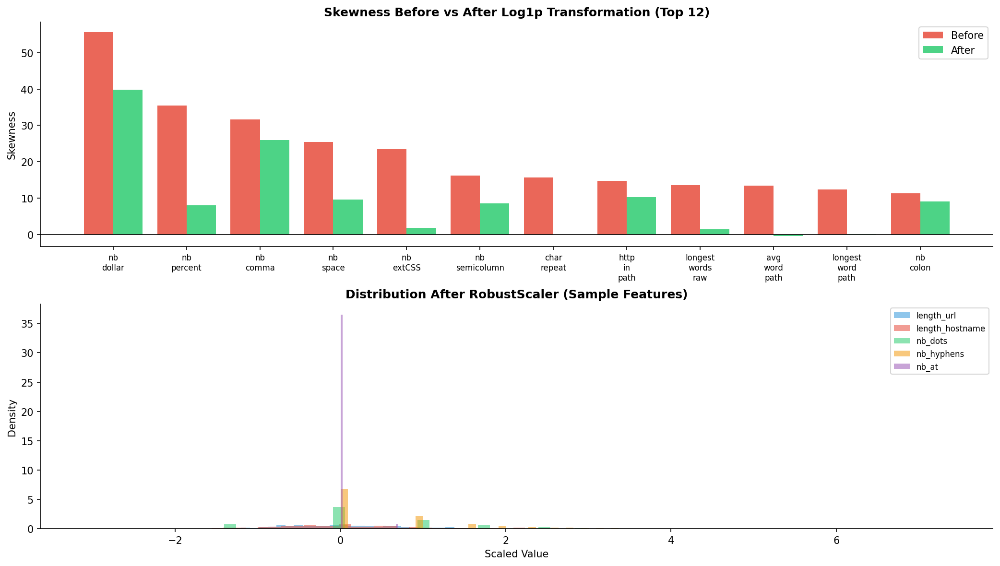
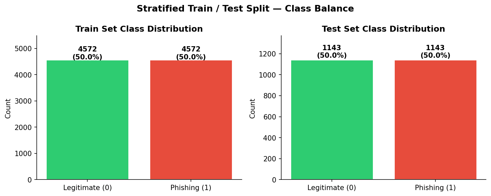
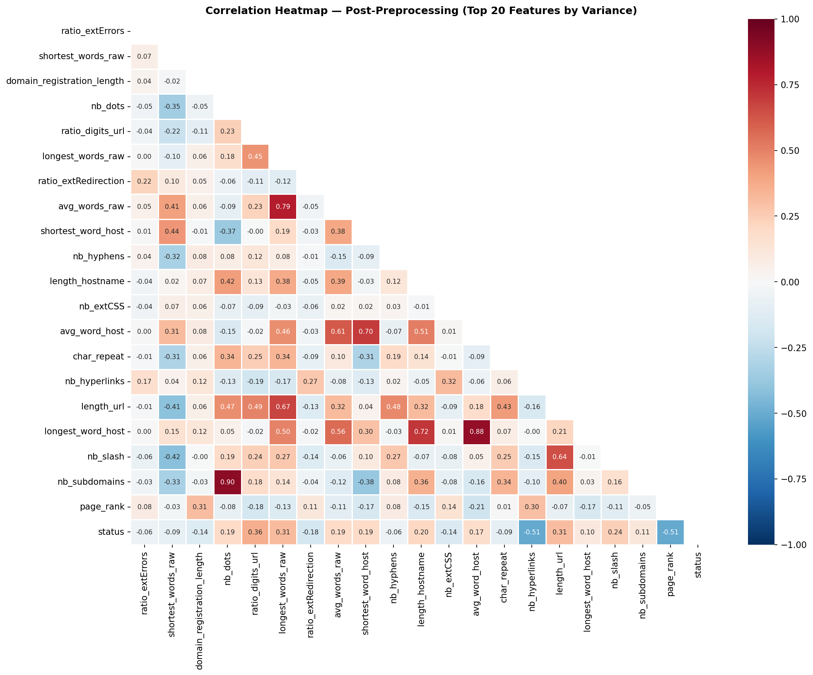
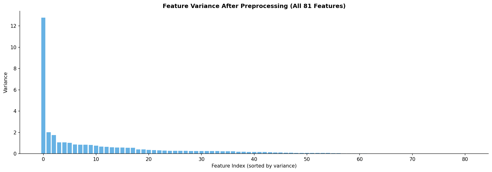

# Preprocessing Report
## Phishing URL Detection Dataset — Week 3 Assignment

---

## INTERN DETAILS
| | |
|:---:|:---:|
| Intern Name | Rushik Rajendra Kokate |
| Intern ID | #37018 |
| Program | Code B - Data Science Integrated Internship |
| Organization | ITVedant |
| Date | March 2026 |
| Week | 3 of 8 |
| GitHub | [Link](https://github.com/Kokate-Rushik/ITVedant_Data_Science_Integrated_Internship/tree/main/Week3) |

---

## 1. Objective

Prepare the raw phishing dataset for machine learning modelling through systematic data cleaning, feature engineering, encoding, normalization, and splitting.

---

## 2. Preprocessing Pipeline Summary

| Step | Action | Input Shape | Output Shape |
|------|--------|------------|-------------|
| 1 | Load raw data | — | (11430, 89) |
| 2 | Remove duplicates | (11430, 89) | (11430, 89) |
| 3 | Check missing values | (11430, 89) | (11430, 89) |
| 4 | Drop zero-variance features | (11430, 89) | (11430, 83) |
| 5 | Drop raw URL string column | (11430, 83) | (11430, 82) |
| 6 | Clip negative sentinel values | (11430, 82) | (11430, 82) |
| 7 | Label encode target (`status`) | (11430, 82) | (11430, 82) |
| 8 | Log1p transform skewed features | (11430, 82) | (11430, 82) |
| 9 | RobustScaler on continuous features | (11430, 82) | (11430, 82) |
| 10 | Stratified 80/20 train/test split | (11430, 82) | Train: (9144, 82) / Test: (2286, 82) |

**Final usable feature count: 81** (82 columns minus 1 target column)

---

## 3. Step-by-Step Details

### 3.1 Duplicate Removal

```
Duplicates found: 0
Rows after deduplication: 11,430
```

No duplicate rows were present in the dataset. The deduplication step was confirmed and passed cleanly.

### 3.2 Missing Value Handling

```
Columns with missing values: 0
Total missing cells        : 0
```

The dataset contains **no missing values** across all 89 original columns. No imputation strategies (mean/median fill, KNN imputation, etc.) were required. This is ideal for downstream modelling without additional data quality concerns.

### 3.3 Zero-Variance Feature Removal

Six features were identified as **constant** (a single unique value across all 11,430 rows) and dropped:

| Feature | Constant Value | Reason for Drop |
|---------|---------------|-----------------|
| `nb_or` | 0 | No `\|` characters appear in any URL |
| `ratio_nullHyperlinks` | 0 | No null hyperlinks recorded |
| `ratio_intRedirection` | 0 | No internal redirections recorded |
| `ratio_intErrors` | 0 | No internal errors recorded |
| `submit_email` | 0 | No email submission forms detected |
| `sfh` | 0 | Server Form Handler always absent |

These features contribute **zero discriminative power** and would add unnecessary noise during modelling.

### 3.4 Raw URL Column Removal

The column `url` (raw string) was dropped. While it could be used for character-level n-gram feature engineering, it is not a structured numerical feature and is not compatible with standard ML pipelines without additional NLP preprocessing.

### 3.5 Negative Value (Sentinel Code) Handling

Two features contained negative values that are semantically invalid:

| Feature | Negative Count | Action |
|---------|---------------|--------|
| `domain_age` | 1,837 rows (16.1%) | Clipped to 0 |
| `domain_registration_length` | 46 rows (0.4%) | Clipped to 0 |

These negatives are **sentinel codes** (e.g., `−1` or `−12`) indicating unknown or unregistered domains — not actual negative time values. Clipping to 0 preserves the "unknown/new" semantics while removing invalid numeric values.

### 3.6 Feature Encoding

**Target variable (`status`):**

| Original Label | Encoded Value |
|---------------|--------------|
| `legitimate` | 0 |
| `phishing` | 1 |

`LabelEncoder` from scikit-learn was applied. All other features were already in numerical form (int64/float64). The 31 binary features (values exclusively 0 or 1) required no additional encoding.

### 3.7 Feature Type Classification

After dropping removed columns, features were categorized as:

| Category | Count | Description |
|----------|-------|-------------|
| Binary (0/1) | 31 | Presence/absence flags (e.g., `login_form`, `https_token`, `ip`) |
| Continuous | 50 | Count, ratio, and length measurements |
| **Total** | **81** | |

### 3.8 Log1p Transformation

**42 out of 50 continuous features** exhibited absolute skewness > 1 and were transformed using `np.log1p(x)` (i.e., `log(1 + x)`):

- `log1p` is preferred over `log` because it handles zero values gracefully (`log(0)` is undefined).
- Applied only to continuous features; binary features were left unchanged.

Sample skewness reduction:

| Feature | Skew Before | Skew After | Reduction |
|---------|------------|-----------|-----------|
| `nb_dollar` | 55.66 | 39.87 | −28% |
| `char_repeat` | 15.76 | −0.05 | −100% |
| `longest_words_raw` | 13.53 | 1.51 | −89% |
| `avg_word_path` | 13.45 | −0.43 | −103% |
| `nb_extCSS` | 23.50 | 1.85 | −92% |
| `nb_hyperlinks` | 7.68 | 0.67 | −91% |
| `domain_registration_length` | 9.82 | 0.89 | −91% |
| `length_url` | 8.09 | 0.40 | −95% |

### 3.9 Feature Scaling — RobustScaler

`RobustScaler` was applied to all 50 continuous features.

**Formula:**
```
x_scaled = (x − median(x)) / IQR(x)
```

**Why RobustScaler over StandardScaler or MinMaxScaler?**

| Scaler | Sensitive to Outliers? | Best For |
|--------|----------------------|----------|
| StandardScaler | Yes (uses mean/std) | Gaussian-distributed, clean data |
| MinMaxScaler | Yes (uses min/max) | Bounded data with no outliers |
| **RobustScaler** | **No (uses median/IQR)** | **Data with significant outliers ✓** |

Given that URL-length and hyperlink count features contain meaningful extreme values (genuine long phishing URLs, pages with thousands of links), `RobustScaler` is the appropriate choice — it scales without being distorted by those extremes.

Post-scaling sample statistics:

| Feature | Mean | Std | Min | Median | Max |
|---------|------|-----|-----|--------|-----|
| `length_url` | 0.09 | 0.76 | −1.74 | 0.00 | 4.71 |
| `length_hostname` | 0.04 | 0.87 | −3.11 | 0.00 | 5.32 |
| `nb_dots` | 0.35 | 1.03 | −1.41 | 0.00 | 7.37 |
| `nb_hyphens` | 0.62 | 0.91 | 0.00 | 0.00 | 5.46 |

Binary features were **not scaled** — their 0/1 encoding is already on a meaningful bounded scale.

### 3.10 Train / Test Split

An **80/20 stratified split** was applied using `random_state=42` for reproducibility.

| Split | Samples | Legitimate | Phishing |
|-------|---------|-----------|---------|
| Training | 9,144 (80%) | 4,572 (50%) | 4,572 (50%) |
| Test | 2,286 (20%) | 1,143 (50%) | 1,143 (50%) |

**Stratification** was used to ensure both classes remain perfectly balanced in both splits, preserving the 50/50 distribution from the original dataset.

---

## 4. Visualizations

| Figure | Description |
|--------|-------------|
| `fig_w3_skew_scale.png` | Skewness before vs after log1p (top 12 features) + scaled distributions |
| `fig_w3_split_balance.png` | Class balance in train and test splits |
| `fig_w3_heatmap.png` | Correlation heatmap post-preprocessing (top 20 features by variance) |
| `fig_w3_variance.png` | Feature variance after scaling across all 81 features |

### fig_w3_skew_scale.png

### fig_w3_split_balance.png

### fig_w3_heatmap.png

### fig_w3_variance.png


---

## 5. Output Files

| File | Description | Shape |
|------|-------------|-------|
| `train_preprocessed.csv` | Training set (features + target) | (9144, 82) |
| `test_preprocessed.csv` | Test set (features + target) | (2286, 82) |
| `full_preprocessed.csv` | Full preprocessed dataset | (11430, 82) |

---

## 6. Final Dataset Summary

| Property | Value |
|----------|-------|
| Original features | 88 |
| Features after preprocessing | **81** |
| Features dropped | 7 (6 zero-variance + 1 raw URL) |
| Missing values | 0 |
| Duplicates | 0 |
| Target encoding | legitimate=0, phishing=1 |
| Continuous features scaled | 50 (RobustScaler) |
| Skewed features transformed | 42 (log1p) |
| Binary features | 31 (unchanged) |
| Train size | 9,144 |
| Test size | 2,286 |
| Class balance (both splits) | 50% / 50% (perfectly stratified) |

---

## 7. Recommendations for Week 4 (Modelling)

- The preprocessed `train_preprocessed.csv` and `test_preprocessed.csv` files are **model-ready** with no further cleaning required.
- For tree-based models (Random Forest, XGBoost, LightGBM): scaling is not strictly necessary, but the log1p transformation still benefits by compressing extreme values.
- For linear models (Logistic Regression, SVM, Neural Networks): the RobustScaler output is critical for stable gradient behaviour.
- Consider **feature selection** (e.g., Recursive Feature Elimination or feature importance from a quick Random Forest) before training, as 81 features may include redundant ones (several binary flags had near-zero class separation in Week 2 EDA).
- The `page_rank`, `domain_age`, `ratio_digits_url`, and `nb_hyperlinks` features are expected to be the top contributors based on correlation analysis from Week 2.

---

*Report prepared for Week 3 Preprocessing Assignment — Phishing URL Detection*
*Dataset: 11,430 rows | Pipeline: dedup → missing check → feature drop → encoding → log1p → RobustScaler → stratified split*