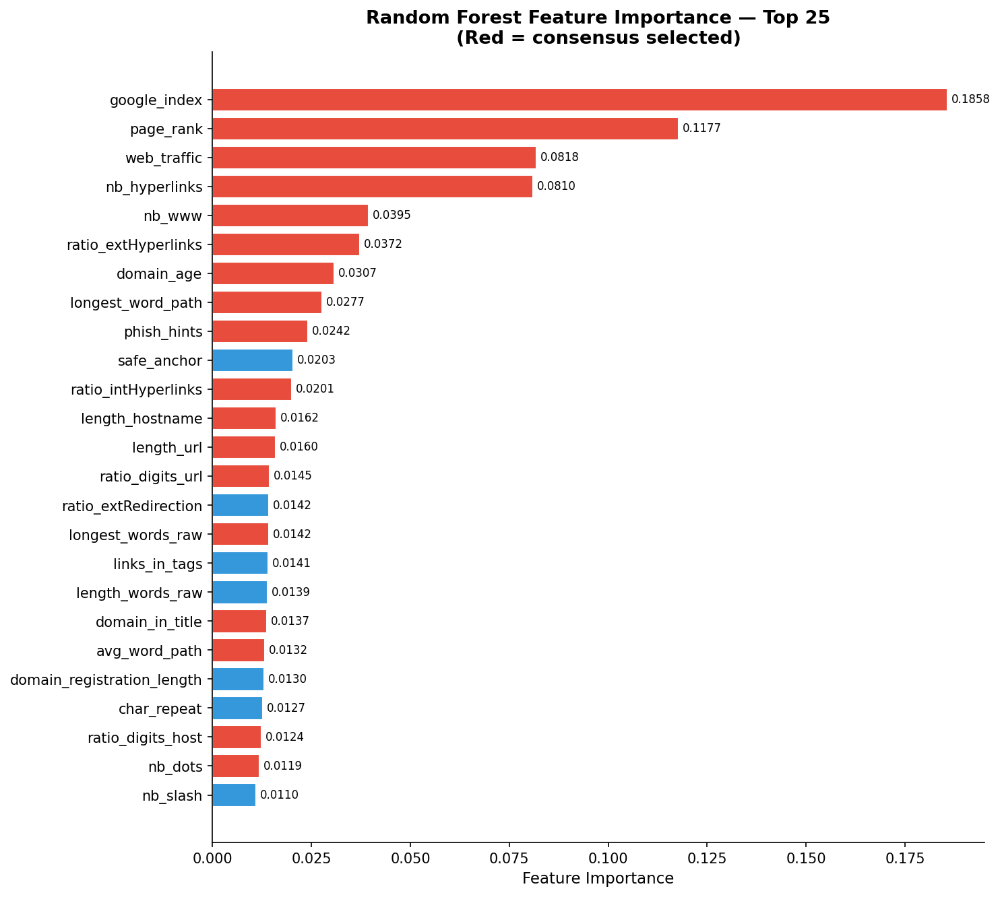
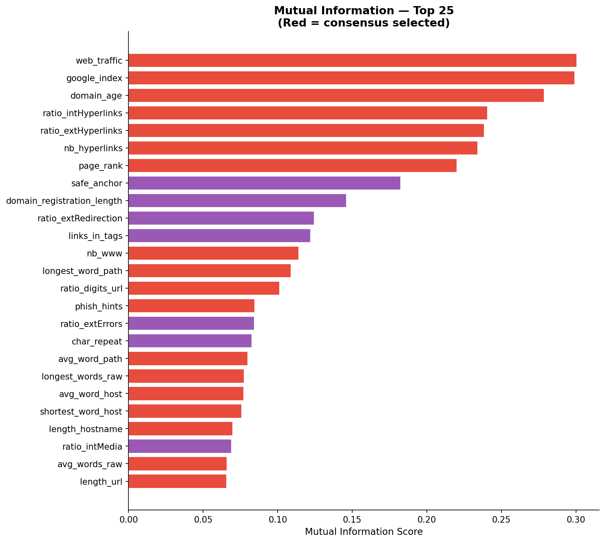
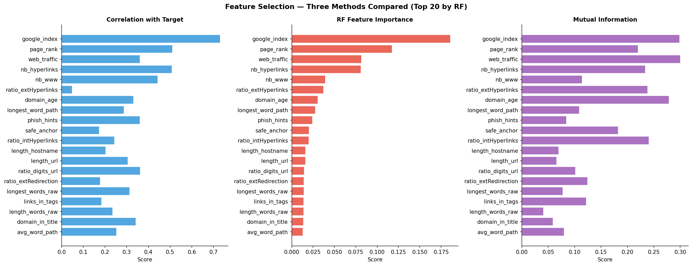
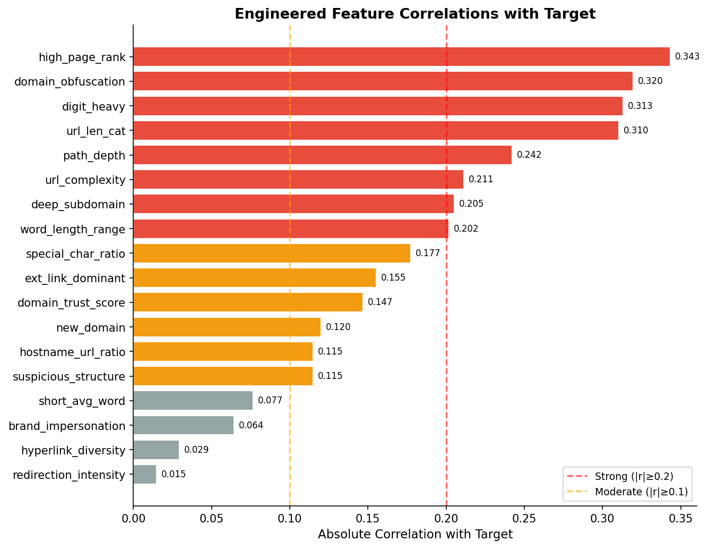
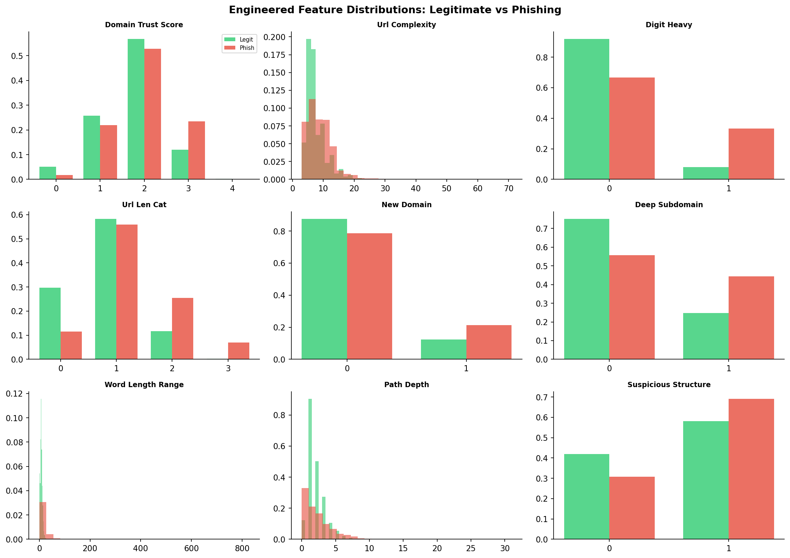
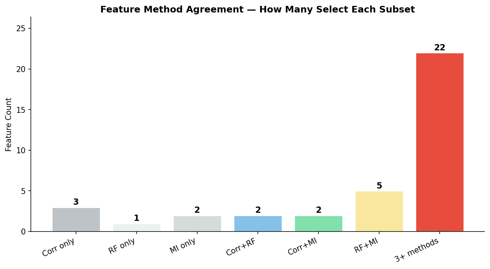

# Feature Selection & Engineering Report
## Phishing URL Detection Dataset — Week 4 Assignment

---

## INTERN DETAILS
| | |
|:---:|:---:|
| Intern Name | Rushik Rajendra Kokate |
| Intern ID | #37018 |
| Program | Code B - Data Science Integrated Internship |
| Organization | ITVedant |
| Date | March 2026 |
| Week | 4 of 8 |
| GitHub | [Link](https://github.com/Kokate-Rushik/ITVedant_Data_Science_Integrated_Internship/tree/main/Week4) |

---

## 1. Objective

Apply systematic feature selection to identify the most discriminative predictors, and engineer new features grounded in domain knowledge of phishing behaviour to produce a refined, enriched dataset for modelling.

---

## 2. Workflow Overview

```
Preprocessed Dataset (81 features)
         │
         ├─── PART A: Feature Selection
         │         ├─ Correlation Analysis
         │         ├─ Random Forest Importance
         │         ├─ Mutual Information
         │         └─ Recursive Feature Elimination (RFE)
         │                   └──→ 22 Consensus Features
         │
         ├─── PART B: Feature Engineering (18 new features)
         │         ├─ URL Structural Features
         │         ├─ Subdomain & Domain Features
         │         ├─ Content & Hyperlink Features
         │         ├─ Word / Token Features
         │         └─ Trust & Reputation Features
         │
         └─── PART C: Refined Dataset (99 features)
                   ├─ train_refined.csv  (9,144 rows)
                   └─ test_refined.csv   (2,286 rows)
```

---

## 3. Feature Selection (Part A)

### 3.1 Method Overview

Four complementary selection methods were applied to minimise method-specific bias:

| Method | Type | Measures |
|--------|------|---------|
| Pearson Correlation | Filter | Linear association with target |
| Random Forest Importance | Embedded | Non-linear, tree-based splits |
| Mutual Information | Filter | Non-linear statistical dependence |
| Recursive Feature Elimination (RFE) | Wrapper | Logistic Regression elimination |

---

### 3.2 Correlation with Target

Top 20 features ranked by absolute Pearson correlation with `status`:

| Rank | Feature | \|r\| | Interpretation |
|------|---------|-------|----------------|
| 1 | `google_index` | 0.731 | Phishing pages are rarely indexed |
| 2 | `page_rank` | 0.511 | Phishing pages have low/zero rank |
| 3 | `nb_hyperlinks` | 0.509 | Phishing pages embed many links |
| 4 | `nb_www` | 0.444 | Phishing URLs fake `www` prefixes |
| 5 | `ratio_digits_url` | 0.362 | Phishing URLs contain more digits |
| 6 | `phish_hints` | 0.362 | Keyword hits in URL |
| 7 | `web_traffic` | 0.361 | Phishing domains have near-zero traffic |
| 8 | `domain_in_title` | 0.343 | Legit pages show brand in title |
| 9 | `domain_age` | 0.332 | Phishing domains are newly registered |
| 10 | `ip` | 0.322 | Phishing URLs often use raw IPs |

**16 features** had \|r\| < 0.05 and were flagged as weak linear predictors.

---

### 3.3 Random Forest Feature Importance

Top 20 features by mean decrease in impurity:

| Rank | Feature | Importance |
|------|---------|-----------|
| 1 | `google_index` | 0.18576 |
| 2 | `page_rank` | 0.11771 |
| 3 | `web_traffic` | 0.08181 |
| 4 | `nb_hyperlinks` | 0.08099 |
| 5 | `nb_www` | 0.03951 |
| 6 | `ratio_extHyperlinks` | 0.03723 |
| 7 | `domain_age` | 0.03073 |
| 8 | `longest_word_path` | 0.02771 |
| 9 | `phish_hints` | 0.02416 |
| 10 | `safe_anchor` | 0.02031 |

The top 4 features alone account for **~56% of total model importance**, indicating the dataset has a small set of highly dominant predictors backed by external reputation services.

**45 features** had RF importance < 0.005 and are considered individually weak.

---

### 3.4 Mutual Information

Mutual Information captures non-linear dependence beyond what Pearson correlation detects.

| Rank | Feature | MI Score |
|------|---------|---------|
| 1 | `web_traffic` | 0.300 |
| 2 | `google_index` | 0.299 |
| 3 | `domain_age` | 0.279 |
| 4 | `ratio_intHyperlinks` | 0.241 |
| 5 | `ratio_extHyperlinks` | 0.239 |
| 6 | `nb_hyperlinks` | 0.234 |
| 7 | `page_rank` | 0.220 |
| 8 | `safe_anchor` | 0.182 |
| 9 | `domain_registration_length` | 0.146 |
| 10 | `ratio_extRedirection` | 0.125 |

Key insight: `ratio_extHyperlinks` scores highly in MI (0.239) but has low Pearson correlation (0.049), confirming a non-linear relationship with the target that correlation-only methods would miss.

**30 features** had MI < 0.01.

---

### 3.5 Recursive Feature Elimination (RFE)

Using Logistic Regression as the base estimator, RFE iteratively eliminated the least informative features, selecting the final **30 features**. Notable RFE-selected features include: `ip`, `nb_hyphens`, `nb_www`, `https_token`, `ratio_digits_host`, `phish_hints`, `ratio_intHyperlinks`, `domain_in_title`, `domain_age`, `web_traffic`, `google_index`, `page_rank`.

---

### 3.6 Consensus Feature Selection

A feature was included in the **consensus set** if it appeared in the top 30 of **at least 3 out of 4 methods**. This produced **22 consensus features**:

| Feature | \|r\| | RF Imp | MI | RFE |
|---------|-------|--------|-----|-----|
| `google_index` | 0.731 | 0.186 | 0.299 | ✓ |
| `page_rank` | 0.511 | 0.118 | 0.220 | ✓ |
| `web_traffic` | 0.361 | 0.082 | 0.300 | ✓ |
| `nb_hyperlinks` | 0.509 | 0.081 | 0.234 | ✓ |
| `nb_www` | 0.444 | 0.040 | 0.114 | ✓ |
| `ratio_extHyperlinks` | 0.049 | 0.037 | 0.238 | ✓ |
| `domain_age` | 0.332 | 0.031 | 0.279 | ✓ |
| `longest_word_path` | 0.287 | 0.028 | 0.109 | ✗ |
| `phish_hints` | 0.362 | 0.024 | 0.085 | ✓ |
| `ratio_intHyperlinks` | 0.244 | 0.020 | 0.241 | ✓ |
| `length_hostname` | 0.203 | 0.016 | 0.070 | ✗ |
| `length_url` | 0.305 | 0.016 | 0.066 | ✗ |
| `ratio_digits_url` | 0.362 | 0.014 | 0.101 | ✗ |
| `longest_words_raw` | 0.314 | 0.014 | 0.077 | ✓ |
| `domain_in_title` | 0.343 | 0.014 | 0.059 | ✓ |
| `avg_word_path` | 0.253 | 0.013 | 0.080 | ✗ |
| `ratio_digits_host` | 0.237 | 0.012 | 0.050 | ✓ |
| `nb_dots` | 0.188 | 0.012 | 0.064 | ✗ |
| `shortest_word_host` | 0.195 | 0.010 | 0.076 | ✗ |
| `avg_words_raw` | 0.188 | 0.009 | 0.066 | ✗ |
| `avg_word_host` | 0.173 | 0.008 | 0.077 | ✓ |
| `ip` | 0.322 | 0.006 | 0.055 | ✓ |

### 3.7 Features to Drop

**15 features** were weak across all three filter methods (correlation, RF, MI):

`random_domain`, `nb_comma`, `onmouseover`, `nb_dollar`, `nb_percent`, `nb_space`, `iframe`, `port`, `right_clic`, `nb_star`, `nb_redirection`, `punycode`, `login_form`, `path_extension`, `nb_tilde`

These can be safely excluded from final modelling pipelines.

---

## 4. Feature Engineering (Part B)

18 new features were created across 6 thematic groups based on domain knowledge of phishing attack patterns.

### 4.1 URL Structural Features

| Feature | Formula / Logic | Rationale |
|---------|----------------|-----------|
| `url_complexity` | `nb_dots + nb_hyphens + nb_at + nb_slash + nb_qm + nb_eq` | Phishing URLs pack more structural complexity to obfuscate the true destination |
| `special_char_ratio` | `(rare chars) / (length_url + 1)` | High density of `%`, `$`, `~`, `;` indicates encoded/obfuscated URLs |
| `url_len_cat` | Binned: 0=short(<30), 1=medium(<75), 2=long(<150), 3=very_long | Categorical encoding of URL length captures non-linear length effects |
| `path_depth` | `max(0, nb_slash − 2)` | Deeper paths indicate complex routing; phishing often nests fake pages |
| `hostname_url_ratio` | `length_hostname / (length_url + 1)` | Low ratio means the path is very long relative to the domain — a phishing signal |

### 4.2 Subdomain & Domain Features

| Feature | Formula / Logic | Rationale |
|---------|----------------|-----------|
| `deep_subdomain` | `1 if nb_subdomains ≥ 3` | `a.b.evil.com` mimics trusted domains with extra subdomain layers |
| `domain_obfuscation` | `clip(ip + prefix_suffix + random_domain + abnormal_subdomain, 0, 1)` | Composite flag for any form of domain identity concealment |
| `brand_impersonation` | `1 if (domain_in_brand=0) AND (brand_in_subdomain=1)` | Brand name in subdomain but not the actual domain — classic typosquatting pattern |

### 4.3 Content & Hyperlink Features

| Feature | Formula / Logic | Rationale |
|---------|----------------|-----------|
| `ext_link_dominant` | `1 if ratio_extHyperlinks > ratio_intHyperlinks` | Phishing pages link outward (to legitimate sites for appearances) more than inward |
| `hyperlink_diversity` | `abs(ratio_extHyperlinks − ratio_intHyperlinks)` | Large divergence indicates an unbalanced link profile |
| `redirection_intensity` | `nb_redirection + 2 × nb_external_redirection` | External redirections are weighted 2× — they are far more suspicious |

### 4.4 Word & Token Features

| Feature | Formula / Logic | Rationale |
|---------|----------------|-----------|
| `word_length_range` | `longest_words_raw − shortest_words_raw` | Large variance in token lengths indicates mixed real/random path components |
| `digit_heavy` | `1 if ratio_digits_url > 0.10` | URLs with >10% digits are likely computer-generated |
| `short_avg_word` | `1 if avg_words_raw < 5` | Short average tokens suggest random character sequences in the path |

### 4.5 Trust & Reputation Features

| Feature | Formula / Logic | Rationale |
|---------|----------------|-----------|
| `domain_trust_score` | `google_index + dns_record + whois + (age>365) + (rank>3)` | 5-point composite trust score; legitimate sites score 4–5, phishing score 0–1 |
| `new_domain` | `1 if domain_age < 180 AND reg_length < 365` | Newly registered and short-lived domains are a hallmark of phishing campaigns |
| `high_page_rank` | `1 if page_rank ≥ 5` | Highly ranked pages are almost certainly legitimate |

### 4.6 Composite Suspicious Behaviour

| Feature | Formula / Logic | Rationale |
|---------|----------------|-----------|
| `suspicious_structure` | `1 if ip=1 OR https_token=0 OR prefix_suffix=1 OR shortening=1` | Any single structural red flag triggers this composite indicator |

---

### 4.7 Engineered Feature Correlations with Target

| Feature | \|r\| with Target | Signal |
|---------|-----------------|--------|
| `url_len_cat` | 0.310 | Strong ↑ phishing |
| `digit_heavy` | 0.313 | Strong ↑ phishing |
| `high_page_rank` | 0.343 | Strong ↑ legitimate |
| `domain_obfuscation` | 0.320 | Strong ↑ phishing |
| `url_complexity` | 0.211 | Moderate ↑ phishing |
| `path_depth` | 0.242 | Moderate ↑ phishing |
| `deep_subdomain` | 0.205 | Moderate ↑ phishing |
| `word_length_range` | 0.202 | Moderate ↑ phishing |
| `new_domain` | 0.120 | Moderate ↑ phishing |
| `ext_link_dominant` | 0.155 | Moderate ↑ phishing |
| `special_char_ratio` | 0.177 | Moderate ↑ legitimate |
| `domain_trust_score` | 0.147 | Moderate ↑ phishing |
| `brand_impersonation` | 0.064 | Weak |
| `hyperlink_diversity` | 0.029 | Weak |
| `redirection_intensity` | 0.015 | Weak |

**Notable:** `high_page_rank` (|r|=0.343) and `domain_obfuscation` (|r|=0.320) are immediately among the strongest new features, competitive with established original features.

---

## 5. Refined Dataset (Part C)

### 5.1 Dataset Composition

| Component | Count |
|-----------|-------|
| Original features (post Week 3 preprocessing) | 81 |
| New engineered features | 18 |
| **Total features in refined dataset** | **99** |

### 5.2 Preprocessing Applied to Refined Dataset

The same Week 3 pipeline was applied to the combined feature set:
- Negative values clipped in `domain_age` and `domain_registration_length`
- `log1p` transformation on all continuous features with `|skew| > 1`
- `RobustScaler` on all continuous features
- Stratified 80/20 train/test split

### 5.3 Output Files

| File | Shape | Description |
|------|-------|-------------|
| `train_refined.csv` | (9144, 100) | Training set — 99 features + target |
| `test_refined.csv` | (2286, 100) | Test set — 99 features + target |
| `full_refined.csv` | (11430, 100) | Full refined dataset |
| `feature_importance_summary.csv` | (81, 4) | Scores from all 4 selection methods |

---

## 6. Visualizations

| Figure | Description |
|--------|-------------|
| `fig_w4_rf_importance.png` | Top 25 features by RF importance (red = consensus) |
| `fig_w4_mutual_info.png` | Top 25 features by mutual information (red = consensus) |
| `fig_w4_method_comparison.png` | Side-by-side: Correlation vs RF vs MI for top 20 |
| `fig_w4_new_features_corr.png` | Absolute correlation of all 18 new features with target |
| `fig_w4_new_feat_dist.png` | Distribution of top 9 engineered features by class |
| `fig_w4_method_agreement.png` | Feature count by how many selection methods agree |

### fig_w4_rf_importance.png

### fig_w4_mutual_info.png

### fig_w4_method_comparison.png

### fig_w4_.png

### fig_w4_new_feat_dist.png

### fig_w4_method_agreement.png


---

## 7. Key Findings Summary

| Finding | Detail |
|---------|--------|
| **Dominant predictors** | `google_index`, `page_rank`, `web_traffic`, `nb_hyperlinks` alone explain ~56% of RF model importance |
| **Non-linear features** | `ratio_extHyperlinks` has low Pearson correlation (0.049) but high MI (0.239) — missed by correlation-only selection |
| **Consensus set** | 22 features agreed upon by ≥3 of 4 methods — recommended core feature set for modelling |
| **Drop candidates** | 15 features are weak in all methods and can be safely excluded |
| **Best new features** | `high_page_rank` (|r|=0.343), `domain_obfuscation` (|r|=0.320), `digit_heavy` (|r|=0.313), `url_len_cat` (|r|=0.310) |
| **Weak new features** | `hyperlink_diversity`, `redirection_intensity`, `brand_impersonation` add minimal signal |
| **Final feature count** | 99 features in refined dataset (81 original + 18 engineered) |

---

## 8. Recommendations for Week 5 (Modelling)

- **Use the refined dataset** (`train_refined.csv` / `test_refined.csv`) as the modelling input.
- **Prioritise the 22 consensus features** for initial lightweight models; expand to all 99 for ensemble methods.
- **Try removing the 15 drop-candidate features** and compare model performance — this reduces noise and training time.
- Start with **Random Forest and XGBoost** — they are naturally suited to this feature mix (binary flags, counts, ratios) and directly confirm the feature importances observed here.
- Consider adding `domain_trust_score` and `domain_obfuscation` as interaction features in logistic regression — their composite nature makes them especially powerful for linear models.
- The top 4 features (`google_index`, `page_rank`, `web_traffic`, `nb_hyperlinks`) are strong enough that a simple decision tree using only these may achieve surprisingly high accuracy — worth validating as a baseline.

---

*Report prepared for Week 4 Feature Selection & Engineering Assignment — Phishing URL Detection*
*Pipeline: 4-method selection → 22 consensus features → 18 engineered features → 99-feature refined dataset*